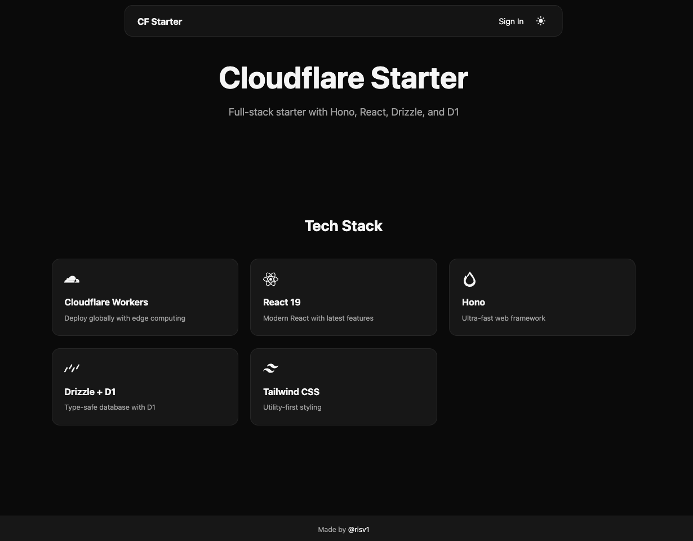

# Cloudflare Starter

Full-stack starter with Hono, React, Drizzle, and D1 cuz I have crashed out enough setting this up like 10 times the past week.

## Tech Stack

- **Cloudflare Workers** - Deploy globally with edge computing
- **React 19** - Modern React with latest features
- **Hono** - Ultra-fast web framework for the backend
- **Drizzle + D1** - Type-safe database with D1
- **Tailwind CSS** - Utility-first styling

## Some stuff

- httpOnly cookies for auth (my usual approach)
- type-safe environment variables
- added bruno config
- didnt add web deployment method I alternatively use vercel or pages so I leave it upto u 0_0

---

Made by [@risv1](https://github.com/risv1)
